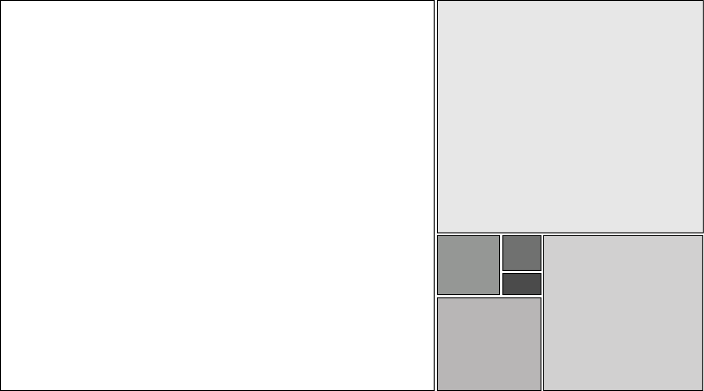

# FibGrid

A CSS Grid layout system built on the Golden Ratio (φ = 1.618).

Columns and rows subdivide recursively using φ, producing seven named cells (A–G) that feel naturally proportioned. No JavaScript. No dependencies. One file.



## Install

**npm**
```bash
npm install fibgrid
```

**CDN** — no install needed, just add to your HTML:
```html
<link rel="stylesheet" href="https://cdn.jsdelivr.net/npm/fibgrid/fibgrid.css">
```

**Manual** — download `fibgrid.css` and link it yourself.

## Basic usage

```html
<div class="fibgrid">
  <div class="fibgrid-cell a">...</div>
  <div class="fibgrid-cell b">...</div>
  <div class="fibgrid-cell c">...</div>
  <div class="fibgrid-cell d">...</div>
  <div class="fibgrid-cell e">...</div>
  <div class="fibgrid-cell f">...</div>
  <div class="fibgrid-cell g">...</div>
</div>
```

You don't have to use all seven cells — omit any you don't need.

## Customisation

Override these CSS custom properties on `.fibgrid`:

| Property | Default | Description |
|---|---|---|
| `--fibgrid-height` | `100dvh` | Height of the grid |
| `--fibgrid-gap` | `0px` | Gap between cells |

```css
.fibgrid {
  --fibgrid-height: 600px;
  --fibgrid-gap: 8px;
}
```

## Usage patterns

### Full-viewport hero

The default — grid fills the entire screen.

```html
<div class="fibgrid">
  <div class="fibgrid-cell a"></div>
  <div class="fibgrid-cell b"><h1>Title</h1></div>
  <div class="fibgrid-cell c"><p>Subtitle</p></div>
</div>
```

### Fixed-height section

Set a specific height to embed the grid inside a page alongside other content.

```css
.fibgrid {
  --fibgrid-height: 500px;
}
```

### Scrollable sticky layout

Wrap the grid in a tall container and make the inner element sticky. Scroll progress can then drive content changes with a small JS scroll listener.

```html
<div style="height: 600vh; position: relative;">
  <div style="position: sticky; top: 0; height: 100dvh;">
    <div class="fibgrid" id="grid">
      <div class="fibgrid-cell a">...</div>
      <!-- etc. -->
    </div>
  </div>
</div>
```

```js
const container = document.querySelector('[style*="600vh"]');
window.addEventListener('scroll', () => {
  const { top } = container.getBoundingClientRect();
  const progress = Math.min(1, Math.max(0, -top / (container.offsetHeight - window.innerHeight)));
  // use progress (0–1) to update grid content
});
```

### With a gap

```css
.fibgrid {
  --fibgrid-gap: 4px;
}
```

### Nested grids

Place a second `.fibgrid` inside any cell to recurse the proportions.

```html
<div class="fibgrid">
  <div class="fibgrid-cell a">
    <div class="fibgrid" style="--fibgrid-height: 100%;">
      <div class="fibgrid-cell a">...</div>
    </div>
  </div>
</div>
```

## Cell reference

| Cell | Grid area | Approx. size |
|---|---|---|
| A | large left column, top rows | 61.8% × 61.8% |
| B | top right strip | narrow × short |
| C | right column | narrow × tall |
| D | bottom strip | wide × short |
| E | small square | ~9% × ~9% |
| F | smaller square | ~5.6% × ~9% |
| G | smallest square | ~5.6% × ~5.6% |

## Demo

[yukseltron.github.io/fibgrid](https://yukseltron.github.io/fibgrid/)
